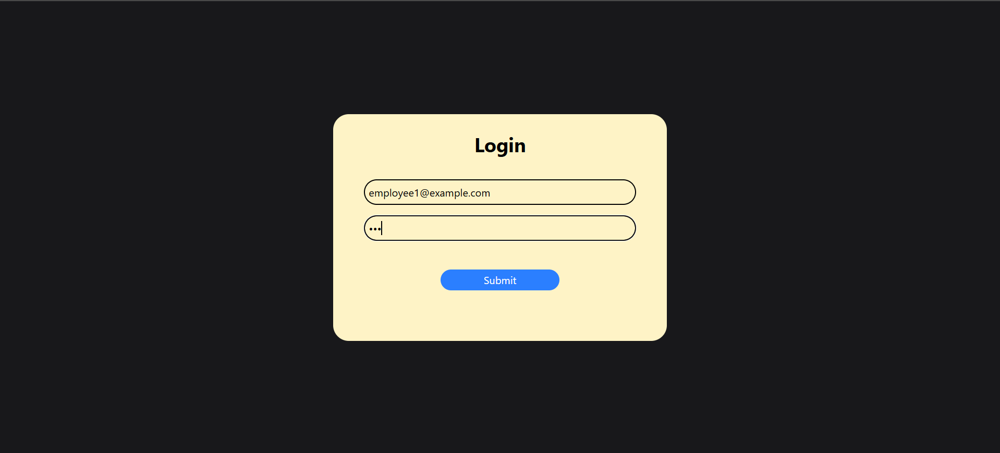
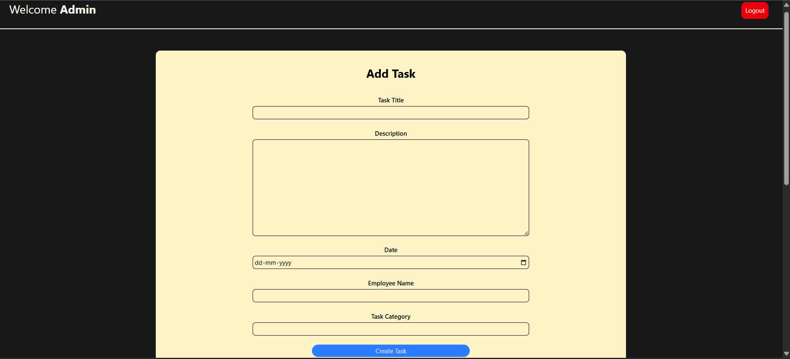
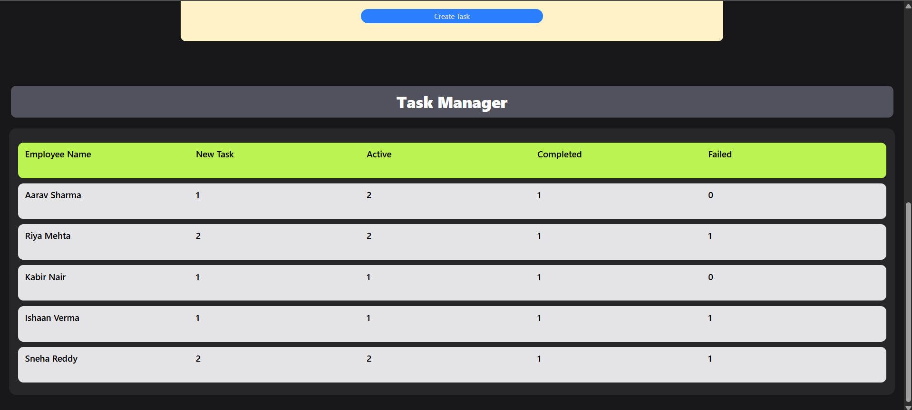
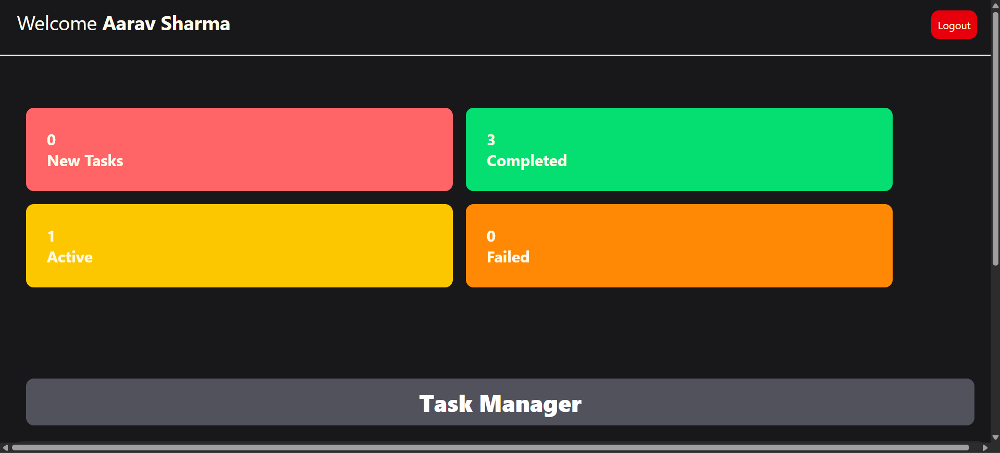
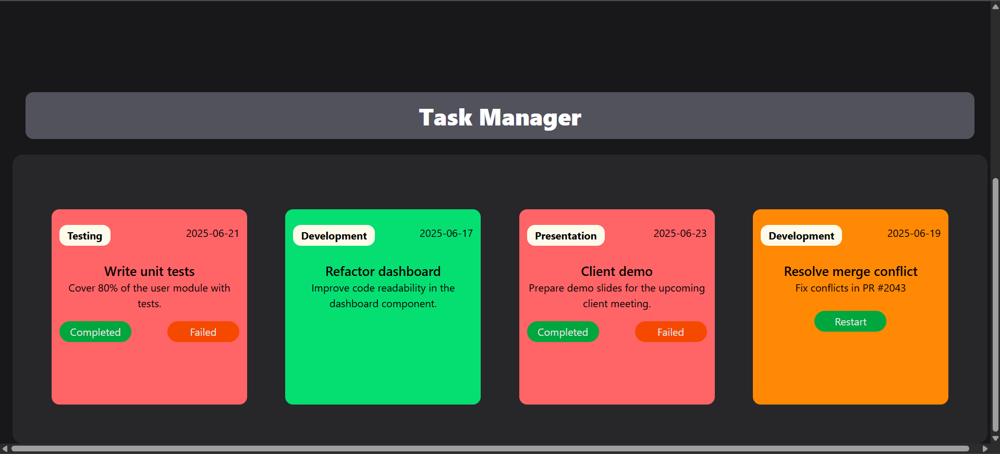

# 🧑‍💼 Employee Task Manager

A responsive, role-based task management system built using **React**, **Tailwind CSS**, and **Vite**. It enables administrators to assign tasks to employees and allows employees to manage their task progress across four clearly defined states: *New*, *Active*, *Completed*, and *Failed* — all stored in the browser via **localStorage**.

---

## 📸 Screenshots


### 🔐 Login Page  


### 🛠️ Admin Dashboard  
  


### 👷 Employee Dashboard  
  



---

## ✅ Features

- 🔐 **Role-Based Login**
  - Admin and Employee login system.
  - Dashboards rendered based on user role.

- 🧑‍💼 **Admin Dashboard**
  - Create tasks with title, description, and date.
  - Assign tasks to employees.
  - View tasks categorized by status:
    - New
    - Active
    - Completed
    - Failed

- 👨‍💻 **Employee Dashboard**
  - View tasks assigned to you.
  - Change task status:
    - New → Active
    - Active → Completed or Failed

- 💾 **LocalStorage-Based Persistence**
  - All data (users, tasks, sessions) is saved in browser localStorage.

- 📱 **Responsive UI**
  - Built using **Tailwind CSS**, works across devices.

---

## ⚙️ Tech Stack

| Category       | Tools / Libraries        |
|----------------|---------------------------|
| **Frontend**   | React                     |
| **Routing**    | React Router DOM          |
| **Styling**    | Tailwind CSS              |
| **Build Tool** | Vite                      |
| **Data**       | useState, useContext, localStorage |

---

## 🚀 Getting Started

### 🔧 Prerequisites

- [Node.js](https://nodejs.org/) (v14 or above)
- npm

### 📦 Installation

```bash
git clone https://github.com/krish-goyal-04/Employee-Task-Manager.git
cd Employee-Task-Manager
npm install
```

### ▶️ Running the App

```bash
npm run dev
```

Visit: [http://localhost:5173](http://localhost:5173)

---

## 🧭 Usage Guide

### 🛠️ Admin Dashboard

- Login as Admin.
- Use **Create Task** form to assign tasks to employees.
- View task statistics and employee-wise breakdown.

### 👷 Employee Dashboard

- Login as Employee.
- View assigned tasks by state.
- View stats of Active, New, Completed and Failed Tasks.
- Complete or fail tasks via interface.
- Tasks are auto-categorized.
- Restart a failed task.

---

## 🗂️ Project Structure

```
src/
├── components/
│   ├── Auth.jsx/
│   │   └── Login.jsx
│   ├── Dashboard/
│   │   ├── AdminDashBoard.jsx
│   │   ├── EmployeeDashBoard.jsx
│   │   └── Mini Components/
│   │       ├── AllTasks.jsx
│   │       ├── CreateTask.jsx
│   │       ├── Header.jsx
│   │       └── TaskListMenu.jsx
│   ├── TaskList/
│   │   ├── AcceptTask.jsx
│   │   ├── CompleteTask.jsx
│   │   ├── FailedTask.jsx
│   │   ├── NewTask.jsx
│   │   └── TasksContainer.jsx
├── context/
│   └── AuthProvider.jsx
├── utils/
│   └── localStorage.jsx
├── App.jsx
├── main.jsx
├── App.css
├── index.css
```

---

## 📈 Future Enhancements

- Replace localStorage with real backend (Firebase, MongoDB, etc.)
- Add user registration with secure auth
- Integrate task sorting and filtering
- Add admin analytics dashboard with charts
- Introduce due dates and priority levels
- Notifications or email alerts on task updates

---


